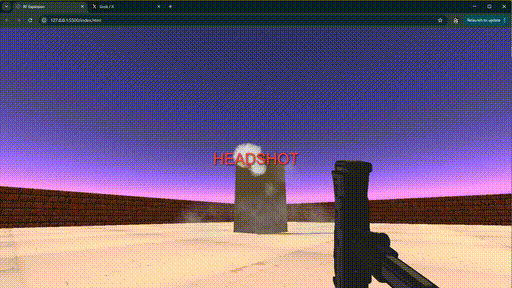

# collision-registry
Collision registry template for an FPS. This is a simple Three.js environment with a 3D model, particle effects system, and a dummy collider (grey box)

- Clone the repository and run the index.html with Live Server to test it out.
- Use WASD to move and right or left mouse click to fire. 
- Aim at the top of the dummy collider (grey box) to get "HEADSHOT." Aim at the bottom of the dummy collider to get "WEAK SAUCE"

**If you get value from this repository follow me on X [@renderfiction](https://x.com/renderfiction)**

